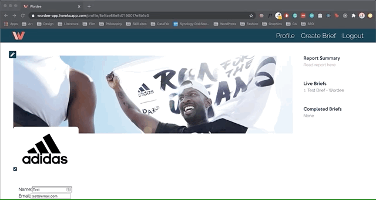
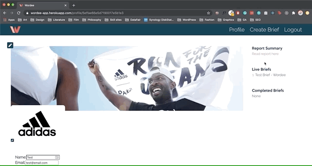

# 

<h1>Personal Project: Wordee</h1>

<h2>Problem: Brands find the process of creating, and sending briefs to copywriters with up to date brand files slow and complicated.</h2>

<h2>Solution: Build a web app that allows a brand to manage all its files easily, while streamlining the briefing process for copywriters.</h2>

| Contents                      |                                |
| ----------------------------- | ------------------------------ |
| 1. [Overview](#overview)      | 6. [Future content](#future)   |
| 2. [Brief](#brief)            | 7. [Wins](#wins)               |
| 3. [Technologies used](#tech) | 8. [Blockers](#blockers)       |
| 4. [App](#app)                | 9. [Bugs](#bugs)               |
| 5. [Approach](#approach)      | 10. [Future learnings](#learn) |

<h2 name='overview'>Overview</h2>

<h3>Introduction</h3>

I was approached by two friends with and idea to create a copywriting briefing tool for brands. It is now being tested by TRIP DRINKS. Wordee allows a brand to upload and update their information and files quickly and easily. It also provides a comprehensive briefing form to make it quick and easy to create a brief. The brand can easily edit and delete all information and briefs. From an admin panel myself and collegues can upload keyword searches for brands to access, while also downloading briefs and brand files to send to freelance copy writers.

<h3>Deployment</h3>

The app is deployed on Heroku and can be found here: https://wordee-app.herokuapp.com <br>
The login details are email: test@email password: pass <br>

<h2 name='brief'>Brief</h2>

- **Build a briefing tool** Create a web app that allows a brand to create, edit and delete brand information and briefs
- **Must have an admin panel** Admins must be able to download briefs and brand files
- **Writers must be access files** use external hosting for files and images
- **Have a simple design**
- **Be deployed online**

<h2 name='tech'>Technologies used and why?</h2>

I used <strong>GraphQL</strong> to reduce the amount of work the server had to do to reduce latency.<br>
I used <strong>Heroku</strong> because it comes ready to use with very little configuration compared to aws. If the project scales I will change to aws due to price concerns.<br>
I used <strong>Firebox</strong> because like Heroku its a quick and simple setup to manage files and allows others to access those files via url.<br>
I used <strong>CircleCI</strong> because I wanted to check every branch was being checked incase it broke my tests.<br>
I used <strong>React</strong> because needed the brief form to be able to react and change quickly to the users imputs.<br>

<p>1. HTML5 <br>
2. SCSS & Bulma <br>
3. JavaScript (ES6) <br>
4. Redux <br>
5. GraphQL <br>
6. Mocha <br>
7. Chai <br>
8. Express <br>
9. React.js <br>
11. Node.js <br>
12. Axios <br>
13. Jest <br>
14. Insomnia <br>
15. Dotenv <br>
16. Cloudinary <br>
17. Firebox <br>
18. CircleCI <br>
19. JWT <br>
20. Yarn <br>
21. Heroku <br>
22. GitHub <br></p>

<h2 name='app'>App</h2>

The brand will log into the app will immediately be able to edit their supporting data that will be sent to copy writers along with their briefs.The brand will be sent a report summary it can access as soon as we have sent it.<br>
<br>
<br>

<br>
<br>
<br>
Creating a brief is made simple by asking the brand to fill out a set of questions my colleagues thought essentially to fully explain what is needed. The brief reacts to choices made adds or removes questions accordingly.<br>
<br>
<br>

<br>
<br>
<br>
The brand can easily edit the brief just by clicking on its list item.<br>
<br>
<br>

<br>
<br>
<br>
The brand can easily change or remove their information.<br>
<br>
<br>

<br>
<br>
<br>
On the backend my colleagues and I are able to view brands and their information and can easily edit report summarys, download briefs to excel, and view images and files.<br>
<br>
<br>


<h2 name='approach'>Approach</h2>
My approach was to always keep the user in mind when I made every decisions, for instance my first instinct was to make a profile page and an edit profile page. However I believe this gave the experiance needless friction for the user. Therefore these pages could be combined for easy and fast manipulation. This eneded making my code more simple too.
<br>
<br>
<h2 name='future'>Future content</h2>
<h3>A writers portal</h3>
We were discussing creating a writers portal and profile and I have some code commented out in the login component should we build this. However we don't currently see any use for this<br>
<br>
<br>
<h3>Email alert system</h3>
We would like to be alerted by email if a user updates their information or edits a brief so we could send the new data to any writers who need it.<br>
<br>
<br>
<h2 name='wins'>Wins</h2>
<h3>Tested by TRIP DRINKS</h3>
[TRIP DRINKS](https://drink-trip.com)
<br>
<br>
<h3>GaphQL</h3>

<br>
<br>
<h3>Redux</h3>

<br>
<br>
<h3>Design</h3>

<br>
<br>
<h2 name='blockers'>Blockers</h2>
<h3>Email feedback</h3>
I struggled to get our email alert system to work with Heroku's deployment. I will continue to work on this when the project is taken off ice.

```javascript
handleChange = (e) => {
  const data = { ...this.state.data, [e.target.name]: e.target.value };
  const errors = { ...this.state.errors, [e.target.name]: "" };
  this.setState({ data, errors });
};
```

<br>
<br>
<br>

<br>
<br>
<br>
<h2 name='bugs'>Bugs</h2>
<h3>Reload page</h3>
Unfortunately a major bug of the app seems to be it is unable to refresh or reload the page you are on. If you do it seems to try and look in the back-end for the address. If this happens you must start from the home address.<br>
<br>
<br>

<br>
<br>
<br>
<h3>SCSS</h3>
The create trip and edit trip pages have a small issue of the form taking up too much space to fit on the page nicely.<br>
<br>
<br>

<br>
<br>
<br>
<h2 name='learn'>Future learnings</h2>
• Look into the reload bug and how this works<br>
