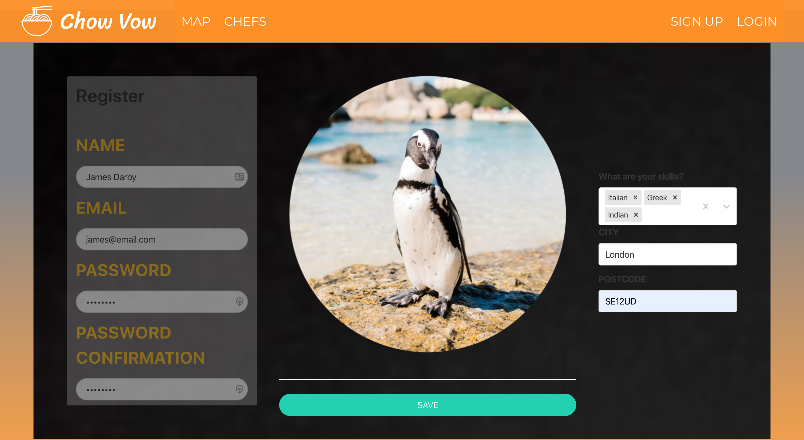
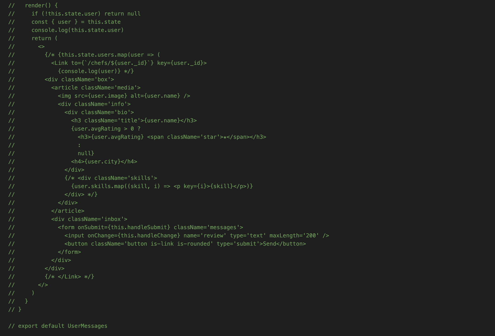
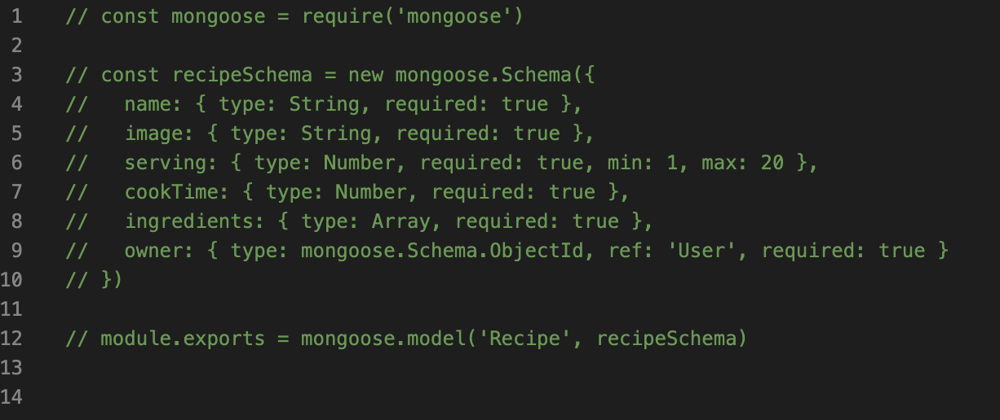
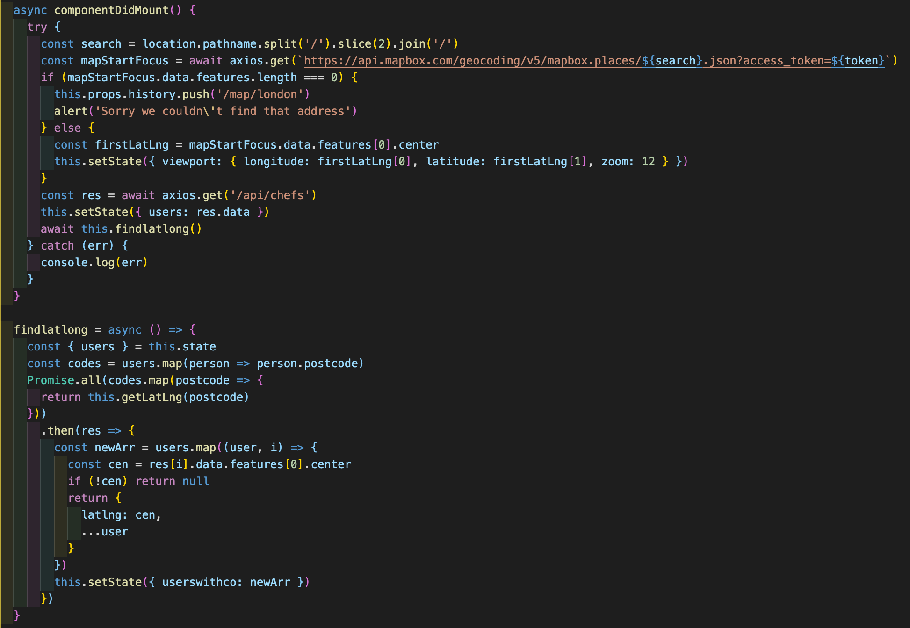
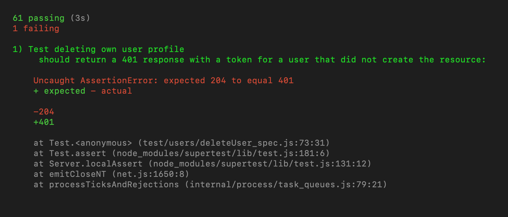
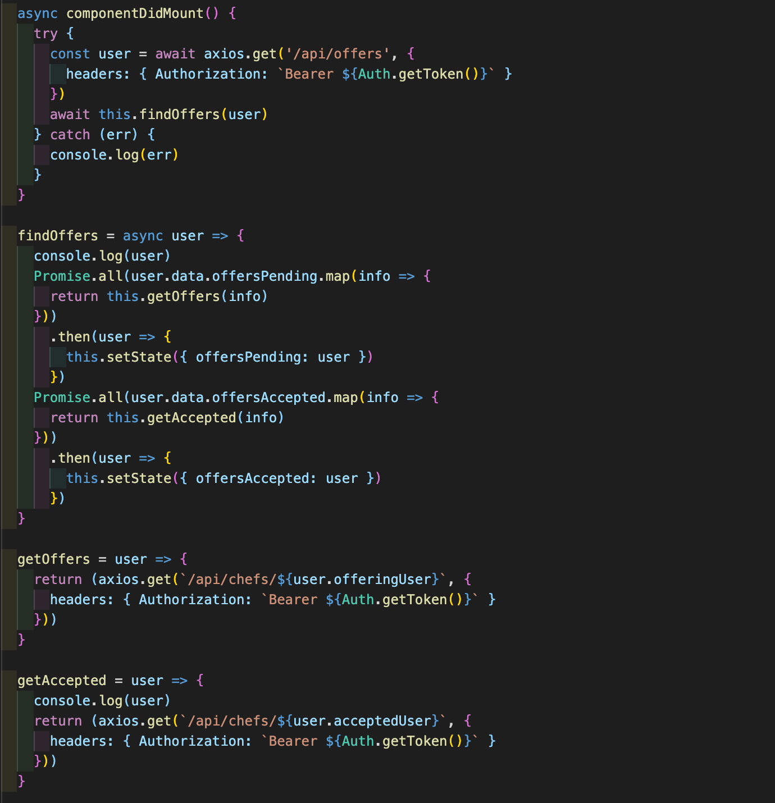

# 

<h1>General Assembly Project Three: Chow Vow</h1>

<h2>Goal: Within a group of four, build a full-stack RESTful MERN application.</h2>

| Contents                      |                |
| ------------------------------|----------------|
|1. [Overview](#overview)       |5. [Future content](#future)
|2. [Brief](#brief)             |6. [Wins](#wins)
|3. [Technologies used](#tech)  |7. [Blockers](#blockers)
|4. [App](#app)                 |8. [Bugs](#bugs)

<h2 name='overview'>Overview</h2>

<h3>Introduction</h3>

Chow Vow is a platform that allows users to search for other individuals that have certain skills within cooking. It then allows users to offer to collaborate in order for them to learn from each other. The users can search via location or via skills. The app uses secure routes meaning users must be logged in to use certain features of the app like viewing others profiles, edit and delete their own profile and send offers of collaboration and accept or delete them.

<h3>Deployment</h3>

The app is deployed on Heroku and can be found here: https://chowvow-ga.herokuapp.com
The login details are  email: ben@email.com password: pass <br>
(The login details are weak to allow easy access, I have addressed this [here](#login))

<h3>Team</h3>

• <a href='https://github.com/EmilySummers'>Emily Summers</a> <br>
• <a href='https://github.com/justteaco'>Tahirah A'sha</a> <br>
• <a href='https://github.com/Tbanks9'>Tim Banks</a> <br>

<h3>My contributions</h3>

• All 62 tests with Mocha & Chai
• Interactive, searchable Mapbox with pop-ups of users at their location that link to their profile
• The offers page and the ability for users to send, accept and delete offers and delete accepted offers
• Setting up the secure route for both front and back-ends

<h3>Timeframe</h3>

7 days

<h2 name='brief'>Brief</h2>

* **Build a full-stack application** by making your own backend and your own front-end
* **Use an Express API** to serve your data from a Mongo database
* **Consume your API with a separate front-end** built with React
* **Be a complete product** which most likely means multiple relationships and CRUD functionality for at least a couple of models
* **Have automated tests** for _at least_ one RESTful resource on the back-end.
* **Implement thoughtful user stories/wireframes**
* **Have a visually impressive design**
* **Be deployed online**

<h2 name='tech'>Technologies used</h2>
<p>1. HTML5 <br>
2. SCSS & Bulma <br>
3. JavaScript (ES6) <br>
4. JSON <br>
5. React.js <br>
6. Node.js <br>
7. Express.js <br>
8. Axios <br>
9. Mongoose & MongoDB <br>
10. Mocha & Chai <br>
11. Insomnia <br>
12. Robo 3T <br>
13. Dotenv <br>
14. Cloudinary <br>
15. Mapbox <br>
16. Z shell <br>
17. JWT <br>
18. GitHub <br><p/>

<h2 name='app'>App</h2>

The user can begin by taking a look around the app when not logged in. They can view the map or the list of users that know a skill. As soon as they try to view anothers profile they a redirected to log in. The user can register and upload a profile image via Cloudinary or log in with their existing information.
<br>
<br>
<br>

<br>
<br>
<br>
They are able to search for any area using the Mapbox Geocoder the interactive map then displays the area and other users within it. The markers display the users profile image and then once clicked a pop-up showing their skills, rating and name appears, this is a link to the users profile where you can see their information and ask to collaborate.
<br>
<br>
<br>

<br>
<br>
<br>
The user has an offers page where they can view offers to collaborate and accept or delete them, they can view their accepted offers and see the accepted users email in order for them to persue their desire to collaborate or they can delete this accepted user.
<br>
<br>
<br>

<br>
<br>
<br>
You may want to search via specific skills, in this case the user can either search the images on the home page or the drop down list when the 'CHEFS' button is selected on the navbar.
<br>
<br>
<br>

<br>
<br>
<br>
In the gif below the user navigates via the 'CHEFS' button to a user they have accepted. This means we can see the users email under the image. As the user has already collaborated with them they leave a review and score. The users average rating is calculated in the back-end and updated immediately.
<br>
<br>
<br>

<br>
<br>
<br>
<h2 name='future'>Future content</h2>
<h3>Messaging</h3>
One of our features we almost finished was a direct messaging feature that would allow the users to communicate via the app once they had accepted each others offer. This mean't we could do away with the slight clunky emailing option. 
<br>
<br>
<br>

<br>
<br>
<br>
<h3>Recipes</h3>
Another feature we had started work on was recipes. We decided to create a model for this and have a one-to-many relationship with the user who creates it. The recipes could then be searchable in a similar way to using the 'CHEFS' button and users could review and rate the recipe.
<br>
<br>
<br>

<br>
<br>
<br>
<h3>Reviews</h3>
Aspects of the reviewing feature that were missing was the ability to update and delete reviews, you are only able to review if you have accepted each others offers and you are only able to review once.
<br>
<br>
<br>
<h3>Offers</h3>
I would have liked to have the users' cards in the offers section link to the users profile.
<br>
<br>
<br>
<h2 name='wins'>Wins</h2>
<h3>Promise.all()</h3>
The whole Mapbox feature was a win for me as I had previously tried in another project to implement markers with pop-ups and failed. A few smaller wins were things such as the user is able to search any area on the home screen and the map would load it, and handling the viewport change, meaning the user could move the map with the mouse. However one really great win for me was learning about the Promise.all() function. Because it is synchronous it allowed me to get the latitude and longitude of each user with the geocoder api in order. Because the Promise waits for each user in the map function to be finished before it starts on the next one, it meant I could setState the user and their coordinates at the same time and not have to worry about the wrong coordinates being attatched to the wrong user.
<br>
<br>
<br>

<br>
<br>
<br>
<h3>Testing</h3>
Before this project testing was an intimidating concept, now after creating 62 tests with Mocha and Chai I see it as a fun and satisfying exercise similar to Codewars. However due to our problems with git merging and branching which I discuss [here] we can see that a test failed after the final merge. The test failed because a user was able to delete a different user. I have now fixed this issue with the following code in controllers/users.js:
<br>

```function destroy(req, res) {
  User
    .findById(req.params.id)
    .then(user => {
      if (!user.equals(req.currentUser._id)) return res.status(401).json({ message: 'Unauthorized' }) //This line was deleted when merged
      if (!user) return res.status(404).json({ message: 'Not Found ' })
      user.remove().then(() => res.sendStatus(204))
    })
    .catch(err => res.json(err))
}
```

<br>

<br>
<br>
<br>
<h3>Offers pending</h3>
The offers page was another big win. When the user sends an offer I had to attach the user sending the offer in the back-end with the following code:
<br>

```
function offersPendingCreate(req, res) {
  User
    .findById(req.params.id)
    .then(user => {
      if (!user) return res.status(404).json({ message: 'Not Found' })
      if (user.equals(req.currentUser._id)) return res.status(401).json({ message: 'Unauthorized' })
      user.offersPending.push({ offeringUser: req.currentUser }) // attaches offering user
      return user.save()
    })
    .then(user => res.status(201).json(user))
    .catch(err => res.json(err))
}
```

<br> 
I had to do this because the object has its own ID and therefore could not see how I could use the populate function. I again turned to the Promise.all() function to allow each GET request to return and therefore setState with all the offers in one array.
<br>
<br>
<br>

<br>
<br>
<br>
<h3>User email</h3>
  

<h2 name='blockers'>Blockers</h2>

<h3 name='merging'>Merging</h3>
